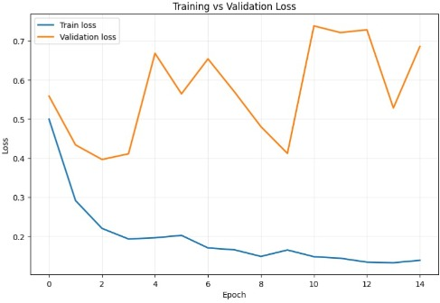
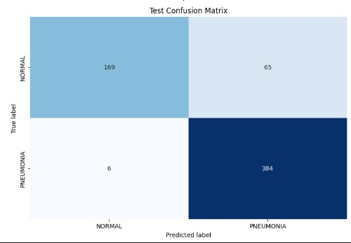
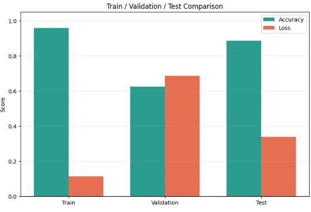
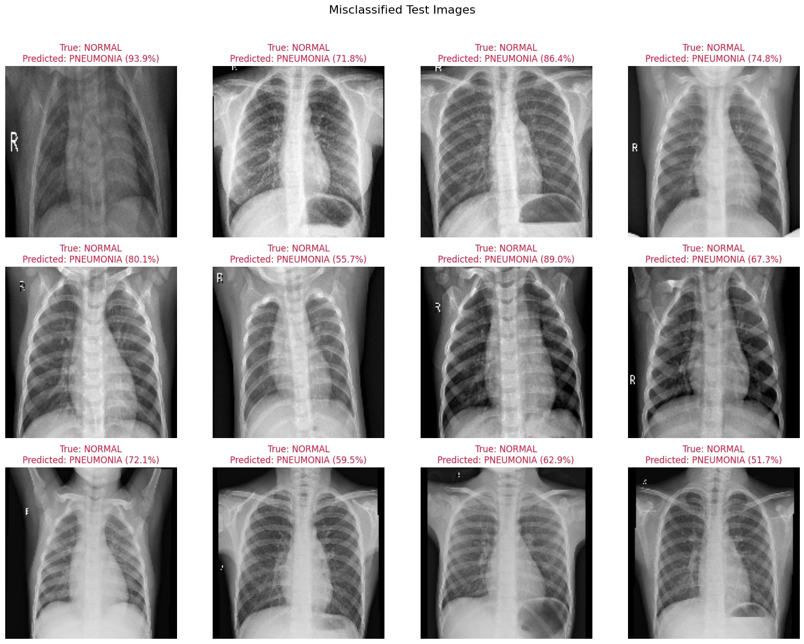
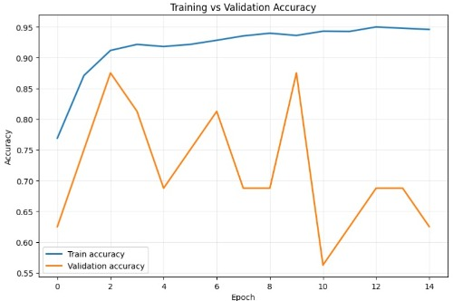

# Chest X-Ray Pneumonia Classification (CNN)

This project trains a Convolutional Neural Network (CNN) to classify pediatric chest X-ray images as **NORMAL** or **PNEUMONIA**, using TensorFlow/Keras in Google Colab.

## Project Structure

```
Pnumonia_Imageclassification/
├── README.md
├── src/
│   └── Solution1.ipynb
└── Diagram/
    ├── 1.jpeg
    ├── 2.jpeg
    ├── 3.jpeg
    ├── 4.jpeg
    └── 5.jpeg
```

## Files

- `src/Solution1.ipynb` — Main notebook containing the full pipeline: data loading, preprocessing, model definition, training, evaluation, and visualization.
- `Diagram/1.jpeg` — Grid of 12 misclassified test images (all true NORMAL cases predicted as PNEUMONIA), with the model's confidence for each.
- `Diagram/2.jpeg` — Bar chart comparing accuracy and loss across the Train, Validation, and Test splits.
- `Diagram/3.jpeg` — Confusion matrix for the test set.
- `Diagram/4.jpeg` — Training vs. validation loss curve over 15 epochs.
- `Diagram/5.jpeg` — Training vs. validation accuracy curve over 15 epochs.

## Dataset

The dataset is a zipped chest X-ray image collection (`Archive (1).zip`) stored in Google Drive, organized into `train`, `val`, and `test` folders, each split into `NORMAL` and `PNEUMONIA` classes. The notebook mounts Google Drive, extracts the archive, and locates these directories automatically.

## Pipeline Overview

1. **Mount & Extract** — Mounts Google Drive and extracts the dataset zip file.
2. **Locate Directories** — Walks the extracted folder to find the `train`, `val`, and `test` subdirectories.
3. **Preprocessing** — Images are resized to 150x150 and rescaled to [0, 1]. Training images are augmented with rotation, zoom, width/height shifts, and horizontal flips via `ImageDataGenerator`. Batch size: 32.
4. **Model Architecture** — A sequential CNN:
   - 4 Conv2D + MaxPooling2D blocks (32 → 64 → 128 → 128 filters, 3x3 kernels, ReLU)
   - Flatten → Dropout (0.5) → Dense(512, ReLU) → Dense(1, Sigmoid)
   - Optimizer: Adam (learning rate 1e-4), Loss: binary cross-entropy
5. **Training** — 15 epochs on the training generator, validated on the validation generator.
6. **Evaluation** — Evaluated on the held-out test set, with a full classification report (precision, recall, F1-score).
7. **Visualization** — Generates the accuracy/loss comparison chart, confusion matrix, loss/accuracy curves, and a grid of misclassified test images.

## Results

| Split      | Accuracy | Loss   |
|------------|----------|--------|
| Train      | ~94.6%   | ~0.14  |
| Validation | ~62.5%   | ~0.69  |
| Test       | 88.62%   | 0.337  |

**Test set classification report:**

| Class     | Precision | Recall | F1-score | Support |
|-----------|-----------|--------|----------|---------|
| Normal    | 0.97      | 0.72   | 0.83     | 234     |
| Pneumonia | 0.86      | 0.98   | 0.92     | 390     |

- Overall test accuracy: **88.62%** (weighted avg F1: 0.88)
- **71 / 624** test images were misclassified — see the misclassified image grid below.
- The confusion matrix below shows the model over-predicts PNEUMONIA on NORMAL cases (65 false positives) while rarely missing true PNEUMONIA cases (only 6 false negatives).

### Train / Validation / Test Comparison


### Confusion Matrix


## Observations

- Training accuracy climbs smoothly and steadily, while validation accuracy is noisy and volatile across epochs, indicating some overfitting and/or a small/imbalanced validation set.
- The model favors recall on PNEUMONIA over precision on NORMAL — it tends to over-flag NORMAL X-rays as PNEUMONIA, as seen in the misclassified examples below.

### Training vs Validation Loss


### Training vs Validation Accuracy


### Misclassified Test Images


## How to Run

1. Open `src/Solution1.ipynb` in Google Colab.
2. Update `ZIP_PATH_IN_DRIVE` to point to your dataset zip file in Google Drive.
3. Run all cells in order (GPU runtime, e.g. T4, recommended).
